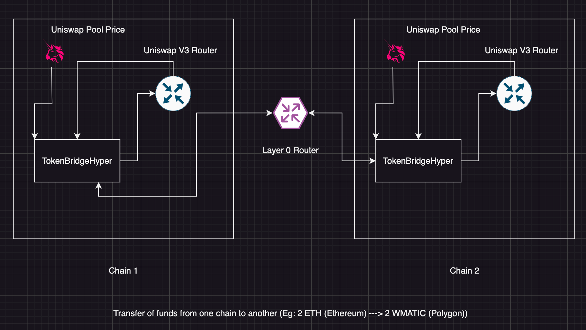

# Hyper Token Bridge

Hyper Token Bridge is a cross chain bridge that allows to swap native token to wrapped native on the other chain. For eg. I want to swap the native `BNB` token into `WMATIC` (or `ETH` into `WMATIC`) token on the polygon chain so hyper bridge can do that in a very less time.

```sh
DEPLOYED ADDRESSES :
--------------------

ETH GOERLI : 0x13A7413c7A15472460149F55d1f3F1465B1f7108
POLYGON : 0xd2dbB4faB85478aF795c06bd36e5f7ed76D51fFe
```

## How it works ?

</img>

### Chain 1

- User initiates the `bridgeToken` function.
- Value of the transaction is checked.
- Upon receiving the asset then the message is sent to another chain using `_lzSend()`.

### Chain 2

- Upon receiving the message from the source chain `_nonblockingLzReceive` function is called.
- Now decoding of the bytes is done and the values are stored.
- After that `_performAssetSwapOnReceiving` function is initiated thus swapping the USDC present on the smart contract with the wrapped native and sending it to the recipient.

### Pool Asset Price Calculation

- Here after receiving the asset on the destination chain the calculation of price will be done as :

```js
// 1. Getting the pool for the assets : USDC/<Native Token>
IUniswapV3Pool pool = IUniswapV3Pool(
    uniswapV3Factory.getPool(
        stableAssetAddressUSDC,
        wrappedAssetAddressNative,
        POOL_FEE
    )
);

// 2. Getting the sqrtPriceX96 price from the pool
(uint160 sqrtPriceX96, , , , , , ) = pool.slot0();

// 3. Getting the amount of the token[0] from the pool
uint256 amount0 = FullMath.mulDiv(
    pool.liquidity(),
    FixedPoint96.Q96,
    sqrtPriceX96
);

// 4. Getting the amount of the token[1] from the pool
uint256 amount1 = FullMath.mulDiv(
    pool.liquidity(),
    sqrtPriceX96,
    FixedPoint96.Q96
);

// 5. Calculating the price for the token in USDC from the pool
uint256 priceFromLiquidityPool = (amount1 *
    10 ** ERC20(stableAssetAddressUSDC).decimals()) / amount0;
```

## Tech Used

- Layer Zero
- Uniswap V3 router
- Uniswap V3 Factory
- Hardhat
- Solidity
- TypeScript

## How to contribute ?

- Getting the repository ready

```sh
git clone https://github.com/Arun89-crypto/HyperTokenBridge
cd HyperTokenBridge
```

- Setting up the dependencies (Contract)

```sh
cd crosschaincontracts
yarn
yarn hardhat compile
```

- To deploy on the network

```sh
yarn hardhat run --network <network> scripts/deploy.ts
```

There are several constants for the deployment that can be found here :

```ts
export const CONSTANTS = {
  TESTNET: {
    ENDPOINTS: {
      BNB_TESTNET: "0x6Fcb97553D41516Cb228ac03FdC8B9a0a9df04A1",
      MUMBAI: "0xf69186dfBa60DdB133E91E9A4B5673624293d8F8",
      ETH_GOERLI: "0xbfD2135BFfbb0B5378b56643c2Df8a87552Bfa23",
    },
    CHAIN_IDS: {
      BNB_TESTNET: "10102",
      MUMBAI: "10109",
      ETH_GOERLI: "10121",
    },
    PRICE_FEEDS: {
      BNB_USD: "0x2514895c72f50D8bd4B4F9b1110F0D6bD2c97526", // Binance Smart Chain
      MATIC_USD: "0xd0D5e3DB44DE05E9F294BB0a3bEEaF030DE24Ada", // Polygon Mumbai
      ETH_USD: "0xD4a33860578De61DBAbDc8BFdb98FD742fA7028e", // Eth Goerli
    },
    UNISWAP_ROUTER_V3: {
      ETH_GOERLI: "0xE592427A0AEce92De3Edee1F18E0157C05861564", // Eth Goerli
      MUMBAI: "0xE592427A0AEce92De3Edee1F18E0157C05861564", // Polygon Mumbai
    },
    UNISWAP_FACTORY_V3: {
      ETH_GOERLI: "0x1F98431c8aD98523631AE4a59f267346ea31F984", // Eth Goerli
      MUMBAI: "0x1F98431c8aD98523631AE4a59f267346ea31F984", // Polygon Mumbai
    },
    WRAPPED_ASSET: {
      WETH: "0xB4FBF271143F4FBf7B91A5ded31805e42b2208d6", // Eth Goerli
      WMATIC: "0x9c3C9283D3e44854697Cd22D3Faa240Cfb032889", // Polygon Mumbai
    },
    STABLE_ASSET: {
      ETH_GOERLI_USDC: "0x07865c6E87B9F70255377e024ace6630C1Eaa37F",
      MUMBAI_USDC: "0xe6b8a5CF854791412c1f6EFC7CAf629f5Df1c747",
    },
  },
};
```

You need to change these constants according to the network in the deploy script.

- To contribute
  - Fork the repository
  - Create new branch : `git checkout -b <branch_name>`
  - Do the changes
  - Create PR

## THANK YOU
